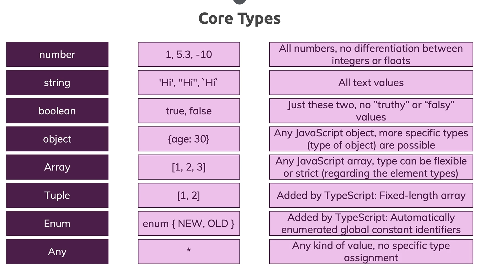

# INDEX

- [INDEX](#index)
- [TypeScript Course](#typescript-course)
    - [by Maximillian Academind (youTube)](#by-maximillian-academind-youtube)
- [TypeScript overview](#typescript-overview)
- [Trabajando con Tipos](#trabajando-con-tipos)
  - [Tipos por defecto](#tipos-por-defecto)
    - [En una función](#en-una-función)
    - [En una variable](#en-una-variable)
  - [Core Types](#core-types)
- [Tipos avanzados](#tipos-avanzados)
  - [Union Types |](#union-types-)
  - [Literal Types](#literal-types)
  - [Types Aliases](#types-aliases)
- [FUNCIONES](#funciones)
  - [Funciones, variables y el tipo Function](#funciones-variables-y-el-tipo-function)
  - [Functions Types and Callbacks](#functions-types-and-callbacks)
  - [Unkown Type](#unkown-type)
  - [Never Type](#never-type)
- [TypeScript extraInformation](#typescript-extrainformation)
  - [TypeScript compiler y cómo configurarlo](#typescript-compiler-y-cómo-configurarlo)
    - [watch mode " -w"](#watch-mode---w)
    - [Compilar un proyecto TS entero " tsc --init"](#compilar-un-proyecto-ts-entero--tsc---init)
    - [tsconfig File](#tsconfig-file)
      - [exclude option](#exclude-option)
      - [include](#include)
      - [Files option](#files-option)
    - [Compiler options](#compiler-options)
      - [Target](#target)
      - [Module](#module)
      - [sourceMap](#sourcemap)
      - [outDir and rootDir](#outdir-and-rootdir)
      - [noEmitOnError](#noemitonerror)

https://ecotrust-canada.github.io/markdown-toc/

---

---

# TypeScript Course

### by Maximillian Academind (youTube)

> <span style="font-size:1.5em;"> [_link del video_](https://www.youtube.com/watch?v=BwuLxPH8IDs&t=581s) </span>

---

- # Introducción
  - ## Que es TypeScript

Es un superset de javaScript, es decir un lenguaje de programación construido sobre JS. Es decir no es un nuevo lenguaje, si no que coge JS y añade nuevas funciones y nuevas ventajas. Lo que hace a JS más sencillo y poderoso.

La desventaja es que TS no puede ser usado en interpretes de JS como el navegador o node.js. Así que para poderlo usar TS debe ser compilado a JS y este es el que será ejecutado.


Ventajas de TS puede ser que introduce tipos de datos y nos facilita debugear el código.

Si tenemos este código

```typescript
const num1 = document.querySelector("#num1");
const num2 = document.querySelector("#num2");
const btn = document.querySelector("button");
const result = document.querySelector("p");

function add(num1, num2) {
  return num1 + num2;
}

btn.addEventListener("click", () => {
  result.innerText = add(num1.value, num2.value);
});
```

Cuando cogemos el valor de un input JS siempre lo hace como un string, lo que el resultado de la función será dos números concatenamos (5+5 = 55).

Para solucionar esto en JS tenemos que comprobar los tipos con **typeof** y conversión a number con el **+** delante

```typescript
function add(num1, num2) {
  if (typeof num1 === "number" && typeof number2 === "number") {
    return num1 + num2;
  } else {
    return +num1 + +number2;
  }
}
```

Esto es un error en el código que TS nos ayuda a evitar.

El archivo escrito en TS sería

```typescript
const num1 = document.querySelector("#num1")! as HTMLInputElement;
const num2 = document.querySelector("#num2")! as HTMLInputElement;
const btn = document.querySelector("button");
const result = document.querySelector("p");

function add(num1: number, num2: number) {
  return num1 + num2;
}

btn.addEventListener("click", () => {
  console.log(add(+num1.value, +num2.value));
});
```

- ! as HTMLInputElement -> indicamos que realmente existe un elemento HTML con ese id (es como una doble comprobación que nos obliga TS)
- num1: number -> indicamos q los argumentos de la función serán tipo number
- +num1.value -> hacemos conversión de tipo (ya q TS ns daba error)

  - ## Instalar TS
    Para ello usaremos node.js y con el gestor de paquetes npm pasamos el siguiente comando

  ```
  sudo npm install -g typescript
  ```

  > Si no tenemos **_nodeJS_** instalado (usando nvm):

  1.  Instalamos nvm
      `curl -o- https://raw.githubusercontent.com/nvm-sh/nvm/v0.35.3/install.sh | bash`

            - comprobamos verison ``` nvm --version ```

  2.  Miramos en la web de node la última versión
      `nvm install 14.9.0` - comprobamos verison `node -v`

Una vez tenemos instalado el compilador de TS para compilar a JS un archivo TS

```
  tsc ts-file.ts
```

Esto nos generará un archivo JS que será el que leerá el interprete de JS(navegador, node,...)


---

---

# TypeScript overview


---

---

# Trabajando con Tipos

TS provee de muchos tipos de datos a JS, incluso permite crear nuestros propios tipos.
Una cosa a tener en cuenta es que en JS los tipos son dinámicos, es decir puedes definir una variable como number y luego reasignarla como String. En camio en TS eso no es posible (usa tipos estáticos) y en tiempo de desarrollo saltará un error.

1. Tipos de datos soportados por JS y TS
   - Number => no hay distinción entre integers y floats
   - Strings => también soporta los templates strigs
   - Boolean
   - Object
2. Tipos exclusivos de TS
   - Object con constructor

## Tipos por defecto

### En una función

Para poder decirle a TS que en la función solo acepte un tipo concreto de datos debemos usar la notación de :

```typescript
function add(n1: number, n2: number) {
  return n1 + n2;
}
```

Al fijar estos dos argumentos como number el editor ya me avisa que tengo un error y cuando intento compilar y salta el error


### En una variable

También podemos usar la notación de ':' cuando definimos una variable.

```typescript
let n1: number;
n1= 5;
}
```

Así 'avisamos' a TS que la variable contendrá un number y si queremos asignarle otro tipo nos dará error.


```typescript
let n1: number= 5;
}
```

esto sería una mala praxis porque el core types de TS tiene una función que se llama **_inferencia de datos_** esto significa que cuando inicializamos una variable TS 'recuerda' que tipo de dato es el inicial y si intentamos darle otro tipo de dato también se quejará.


## Core Types



- ### Number
- ### Strings
- ### Booleans
- ### OBJECTS

```typescript
const person = {
  name: "david martin",
  age: 36,
};

console.log(typeof person); // object
console.log(person.name); // david martin
```

- ### ARRAYS

Soporta cualquier array creado como JS, arrays mezclando tipos, nested arrays, etc...
Los arrays en TS pueden ser flexibles o estrictos

1.  cuando creamos un array TS detecta qué tipo de datos contiene

```typescript
const person = {
  name: "david martin",
  age: 36,
  hoobies: ["sports", "cooking"],
};
```


Esto permite al IDE sugerir métodos a los elementos del array según su tipo, como el método .toUpperCase()


2.  Puedo definir un array previamente para que solo contenga un tipo de dato

```typescript
let favoriteActivities: string[];

favoriteActivities = ["sports"];
```

3. o bien para que pueda contener una ezcla de dos tipos de datos

```typescript
let favoriteActivities: (string | number)[];

favoriteActivities = ["sports", 5];
```

4. o cualquier tipo de datos, aunque esto no tiene mucho sentido en TS xq entonces sería como un array de JS, no tenemos control sobre los tipos

```typescript
let favoriteActivities: any[];

favoriteActivities = ["sports", 5, { name: "david" }];
```

- ### Tuples

Podemos crear tuples como en Python.
Una tupla es como un array en cuanto a estructura pero la diferencia es que nos permite fijar que tipo de datos contendrá y la longitud total de la tupla

```typescript
let tupla: [number, string];

tupla = [10, "david"]; // cumple con la estructura

tupla[1] = 5; // no me permite poner en la segunda posición  un number

tupla = ["david", 1]; // no me permite poner un number seguido de string

tupla = [1]; // no cumple ni tamaño no tipo de datos

tupla = [10, "david", 5]; // no cumple  tamaño*/

tupla.push("david2"); // esto si está permitido pero no debería ERROR!!
```

- ### Enum

Es el primer tipo de dato personalizado. Es como crear un objeto. Se usan cuando quieres tener identificadores legibles o fáciles de entender.

```typescript
// creo mi enum
enum Role { ADMIN, READ_ONLY, AUTHOR  };

=> lo que sucede aquí es q cada elemento del enum estaá asociado a un número, si vemos el códgo JS compilado :

(function (Role) {
    Role[Role["ADMIN"] = 0] = "ADMIN";
    Role[Role["READ_ONLY"] = 1] = "READ_ONLY";
    Role[Role["AUTHOR"] = 2] = "AUTHOR";
})(Role || (Role = {}));

=> es posible cambiar ese valor por defecto q empieza x el 0

enum Role { ADMIN = 5, READ_ONLY, AUTHOR  };

ó

enum Role { ADMIN = 'ADMIN' , READ_ONLY=100, AUTHOR=200  };

si hacemos esto automáticamente READ_ONLY y AUTHOR adquieren el 6 y 7 respectivamente.

//creo un objeto

enum Role {
  ADMIN,
  READ_ONLY,
  AUTHOR,
}

const person = {
  name: "david martin",
  age: 36,
  hoobies: ["sports", "cooking"],
  role: Role.ADMIN,
};

if (person.role == Role.ADMIN) {
  console.log(person.role);
}

```

- ### Any

Es el tipo más flexible. No da información de tipo a TS. Básicamente puede contener cualquier tipo de dato.

Es mejor no usar este tipo porque desaprovechamos las ventajas de TS.

```typescript
let myArray: any[];

myArray = [1, "avid", [1, 2, 3], { name: "david" }];
```

# Tipos avanzados

## Union Types |

Esto nos permite aceptar más de un tipo de dato en una función pero lo q causa es que luego dentro de la función tendremos que adaptar la lógica.

```typescript
function combine(input1: number | string, input2: number | string) {
  let result;

  if (typeof input1 === "number" && typeof input2 === "number") {
    result = input1 + input2;
  } else {
    result = input1.toString() + input2.toString();
  }

  return result;
}
```

## Literal Types

Permite fijar un valor para los atributos de la función.

```typescript
function combine2(
  input1: number | string,
  input2: number | string,
   resultConversion: 'as-number' | 'as-text') {

  let result;

  if (typeof input1 === 'number' && typeof input2 === 'number' || resultConversion === 'as-number'){

    result = +input1 + +input2;

  }else{
    result = input1.toString() + input2.toString();
  }

  return result;
}
}
```

## Types Aliases

Creamos un alias que incluye todos los tipos presentes en un operador union
Para crearlo usamos la keyword type

```typescript
type NumberString = number | string;
type ConversionDescripyor = "as-number" | "as-text";

function combine3(
  input1: NumberString,
  input2: NumberString,
  resultConversion: ConversionDescripyor
) {
  let result;

  if (
    (typeof input1 === "number" && typeof input2 === "number") ||
    resultConversion === "as-number"
  ) {
    result = +input1 + +input2;
  } else {
    result = input1.toString() + input2.toString();
  }

  return result;
}
```

# FUNCIONES

Las funciones en TS:

- Tipo de dato de los parámetros
- Tipo de dato de retorno o void

En cuanto al tipo de dato de retorno TS lo puede inferir según los tipos de los parámetros.


si modificamos el return TS tb lo detecta


Si queremos fijar el tipo de retorno lo hacemos con ":" después de la función

```typescript
function add3(n1: number, n2: number): number {
  return n1 + n2;
}
```

Si dentro de la función hacemos un console.log() esa función no devuelve nada lo que llamamos "void"


## Funciones, variables y el tipo Function

Podemos asignar una función a una variables de la siguiente manera:

```typescript
function add3(n1: number, n2: number): number {
  return n1 + n2;
}

let combineValues = add3;
```

Si lo dejo así esa variable le puedo asignar cualquier otro valor y eso ocasionar un error en el código. Para evitar eso tenemos el tipo Function en TS que nos permite fijar que una variable contendrá una función y además especificar cómo será esa función

```typescript
function add3(n1: number, n2: number): number {
  return n1 + n2;
}
let combineValues: Function;
```

Si lo dejo así puedo asignar a la variable cualquier función, vamos a acotar más el asunto para ello con notación de arrow function fijamos los tipos de los arámetros y del retorno

```typescript
let combineValues: (a: number, b: number) => number;

combineValues = add;
```

si la función devuelve otro tipo de dato TS se quejará


## Functions Types and Callbacks

Podemos definir como será el callback que recibe la función

```typescript
function addAndHandle(
  a: number,
  b: number,
  callBackFunction: (num: number) => void
) {
  const result = a + b;

  callBackFunction(result);
}

addAndHandle(10, 20, (result) => {
  //creamos una función anónima que es el callback
  console.log(result);
});
```

## Unkown Type

Es parecido a [any](###any) pero más restrictivo. Tengo que hacer una comprobación extra.

```typescript
let userInput: unknown;
let userName: string;

userInput = 5;
userInput = "ddd";

if (typeof userInput === "string") {
  userName = userInput;
}
```

## Never Type

Es un tipo que puede devolver una función, normalmente se usa en funciones que lanzan un error

```typescript
function generateError(message: string, code: number): never {
  throw { message: message, errorCode: code };
}

generateError("a error has ocurred", 500);
```


# TypeScript extraInformation

## TypeScript compiler y cómo configurarlo

### watch mode " -w"

Para compilar el archivo TS debemos dar la orden en consola de "tsc app.ts" si no queremos tener que compilar a cada cambio debemos entrar en modo watch para ello

```
tsc app.ts -w
```

### Compilar un proyecto TS entero " tsc --init"

Si en un proyecto tenemos varios archivos TS y queremos ejecutarlo todos tendremos que primero crear un archivo de configuración tsconfig.json mediante el comando

```
tsc --init
```

y luego mediante ejecutar todos los archivos TS (sin especificar ningún archivo)

```
tsc
```

podemos ajecutarlo en modo watch

```
tsc -w
```

### tsconfig File

es un JSON donde podemos modificar el comportamiento del compilador en este proyecto.

#### exclude option

creamos un array en el JSON donde especificamos los archivos/folders q no queremos que se compilen.

Por defecto ya excluye los módulos de node.


#### include

solo compilará los archivos especificados en esta sección. Podemos incluir archivos y carpetas.


#### Files option

Esencialmente es como include, en el sentido que permite compilar archivos en concreto pero se diferencia en que no podemos incluir carpetas.


### Compiler options

Una vez especificamos qué archivos se van a compilar podemos gestionar cómo será esa compilación.

#### Target

Especificamos a que versión de JS vamos a compilar el archivo TS, por defecto "
"es5". Con lo que podemos generar código JS que funcione en browser antiguos.


#### Module


Por defecto la opción lib está desactivado y esto es porque coge las librerias compatibles con la versión de JS especificada en "target". Si descomentamos lib y lo dejamos vacío nos dará error de compilación xq espera unos valores, por ejemplo la libreria.


#### sourceMap

Si lo descomentamos permite conservar los archivos TS para poderlos visualizar en el navegador y poder hacer debugging.

#### outDir and rootDir

Normalmente los proyectos tienen una carpeta source donde están los archivos TS y una carpeta dist donde uardamos los archivos JS resultantes de la compilación.

- outDir => le decimos a TS donde guardar los archivos JS
- rootDir => indicamos dónde están guardados los archvos TS, si especificamos una carpeta y esta tiene subcarpetas tb buscará archivos TS dentro de esta.

#### noEmitOnError

Por defecto está seteado en false, esto indica que si TS tiene errores igualmente generará el archivo JS, si lo ponemos en True mientras haya errores no compilará ningún archivo a JS.


